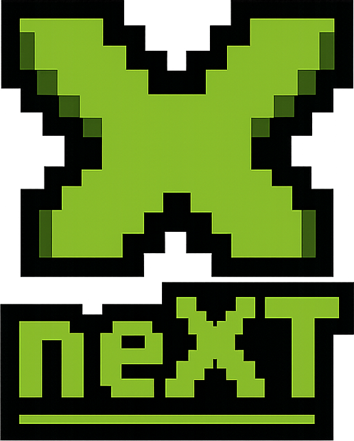
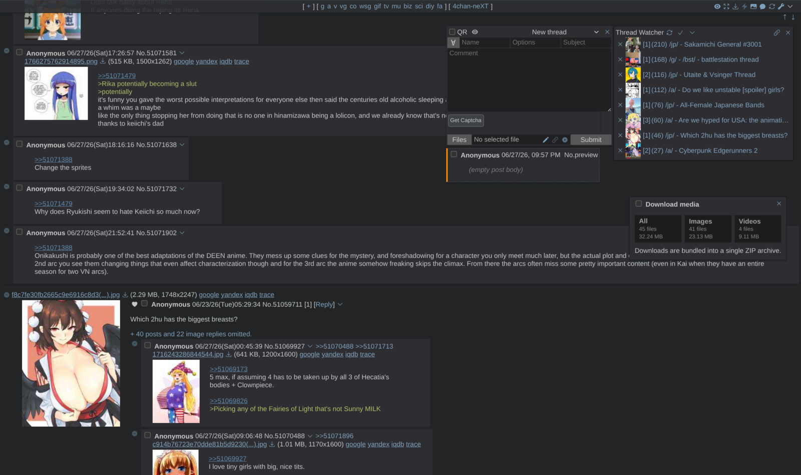

<h1>
  
  4chan-neXT
</h1>

4chan-neXT is an actively maintained 4chan X fork with compatibility fixes, UI improvements, and fork-specific features.



## Install

- **Stable userscript (recommended):**
  - https://github.com/cercos/4chan-next/releases/latest/download/4chan-neXT.user.js
- **Minified userscript:**
  - https://github.com/cercos/4chan-next/releases/latest/download/4chan-neXT.min.user.js
- **Releases page:**
  - https://github.com/cercos/4chan-next/releases

You will need a userscript manager:
- Firefox: [Violentmonkey](https://addons.mozilla.org/en-US/firefox/addon/violentmonkey/) or [Tampermonkey](https://addons.mozilla.org/en-US/firefox/addon/tampermonkey/)
- Chrome/Edge: [Violentmonkey](https://chromewebstore.google.com/detail/violentmonkey/jinjaccalgkegednnccohejagnlnfdag) or [Tampermonkey](https://tampermonkey.net/)

Minimum supported versions:
- Chrome 90+
- Firefox 78+
- Greasemonkey 1.14+

New users should start with the [User Guide](./docs/user-guide.md).

## Current Release

`1.2.4` (2026-07-02)

- Fixed the "Click Passthrough" setting not applying when off in Firefox.
- Stopped settings migrations from overwriting your existing preferences on update.
- Fixed the header board links sitting slightly off-center when "Centered links" is on.

See [CHANGELOG.md](./CHANGELOG.md) for full release notes.

## Migration from 4chan X / 4chan XT

4chan-neXT uses its own userscript namespace.

To migrate settings:
1. Export settings from your current script.
2. Install 4chan-neXT.
3. Import your settings into 4chan-neXT.

## Compatible Styling Scripts

- StyleChan: https://github.com/3nly/StyleChan
- Styling guide (Custom CSS, userstyles, and theme-aware highlight overrides): [docs/styling-guide.md](./docs/styling-guide.md)
- Styling hooks (highlight classes and `--xt-*` CSS variables for custom CSS / userstyles): [docs/styling-hooks.md](./docs/styling-hooks.md)

## Fork Additions

### Quick Reply and posting
- Per-thread `QR Drafts` restore with attachment persistence and a recoverable discard bin
- Image auto-processing and audio stripping for boards that disallow audio
- Stacked TCaptcha editing
- Auto-close Tags
- Post-style comment preview with docked, QR-attached, and floating modes

### Thread Watcher and monitoring
- Quick Reply docking and attach-location controls
- QR/window resize handling and remembered floating QR reopen behavior
- OP thumbnails and hover thumbnail previews
- Mark-all-read and per-thread mark-read icons

### Styling and themes
- Built-in site themes with SFW/NSFW styling variants
- Generic styling-script integration: detects and names the active styling script, hands individual sections (Site Style, Text Colors, Custom CSS) over to it per-section, and links to its own settings
- Theme-aware highlight colors and text color modes
- Custom CSS editor pairing/indent helpers
- A local styling guide

### Scrollbar markers
- Own-post, quotes-you, ghost-post, and unread-line markers
- Per-marker colors, opacity, and match-highlight controls
- Beside-scrollbar and IDE-style over-scrollbar layouts

### Filters
- Responsive Simple Filters with auto-save
- Color swatches plus custom CSS classes
- Index/catalog search over preview replies with an `op:` prefix and per-field regex (`comment:/cat|dog/i`) that highlights matches in the results
- Hidden-thread grouping, and showing hidden threads with unread replies to you
- `highlight:` class lists and catalog `tile` highlight glow

### Gallery and media
- Grid gallery thumbnails with configurable columns and thumbnail dock position
- ZIP-based download-all-media support
- Thumbnail replacement and metadata visibility controls
- Video duration badge on webm/mp4 thumbnails, read lazily as they scroll into view

### Linkification
- YouTube -> yewtu.be link rewriting
- X/Twitter -> xcancel link rewriting

### Settings and UI
- Selectable icon set across the UI (Font Awesome, Lucide, Material, Phosphor, Tabler, Bootstrap, Heroicons, Ionicons)
- Highlight neXT markers for fork-specific settings
- Vertical or horizontal Settings navigation
- CSS Custom Highlight API search highlighting and a search-friendly layout
- Local user/styling docs

## Development

```bash
npm install
npm run testbuild
npm run typecheck
```

Requirements:
- Node.js 16+

Useful commands:
- `npm run testbuild`: development build for local testing. Outputs to `testbuilds/`.
- `npm run typecheck`: TypeScript compile check for `src/`.
- `npm run build`: production release build. Writes release artifacts to `builds/`.
- `npm run build:userscript`: production userscript build.
- `npm run build:min`: minified userscript build.
- `npm run build:crx`: production Chrome extension build.
- `npm run build:crxp`: build and pack CRX using a key from `../4chan-next.keys/*.pem` (override with `CRX_KEY_FILE`).
- `npm run build:all`: full multi-platform release build. Slow and writes release artifacts to `builds/`.

Useful build flags for `tools/rollup`:
- `-min`: minified output.
- `-platform=userscript` or `-platform=crx`: build only one target.
- `-no-format`: skip output formatting steps.
- `-test`: include tests in build.

## Links

- User Guide: [docs/user-guide.md](./docs/user-guide.md)
- Styling Guide: [docs/styling-guide.md](./docs/styling-guide.md)
- Styling Hooks: [docs/styling-hooks.md](./docs/styling-hooks.md)
- Changelog: [CHANGELOG.md](./CHANGELOG.md)
- Issues: https://github.com/cercos/4chan-next/issues
- Contributing: [CONTRIBUTING.md](./CONTRIBUTING.md)
- Upstream FAQ: https://github.com/ccd0/4chan-x/wiki/Frequently-Asked-Questions
- This fork FAQ: https://github.com/cercos/4chan-next/wiki/Frequently-Asked-Questions
